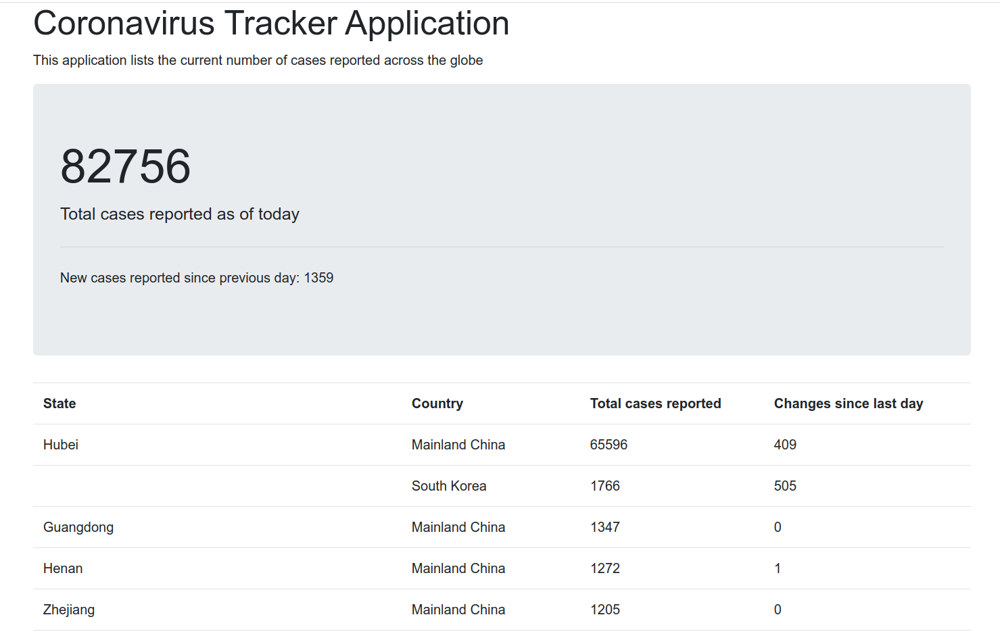

### Application lists the current number of cases reported across the globe

Data provided from [Novel Coronavirus (COVID-19) Cases, provided by JHU CSSE](https://github.com/CSSEGISandData/COVID-19)

Launch main class and navigate to:

    http://localhost:8080
    
Home page should look like:

    
    
##### to do list

- [ ] add tests    